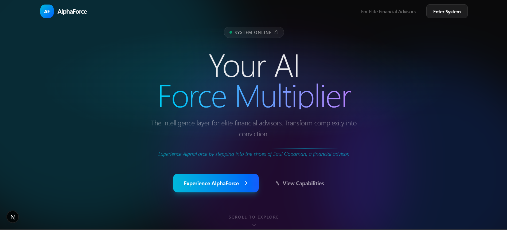
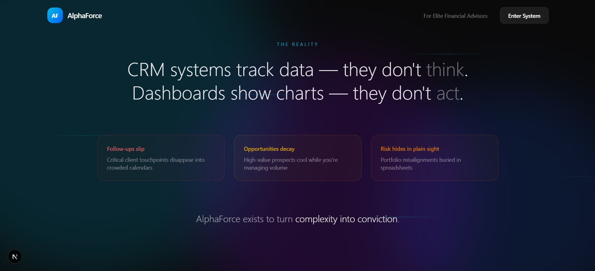
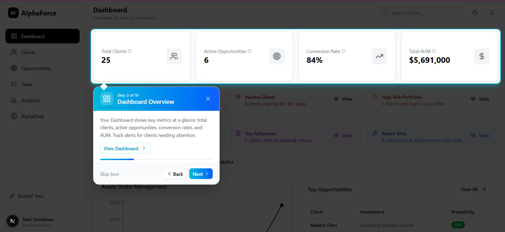
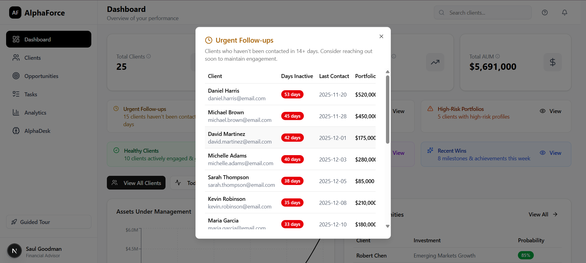
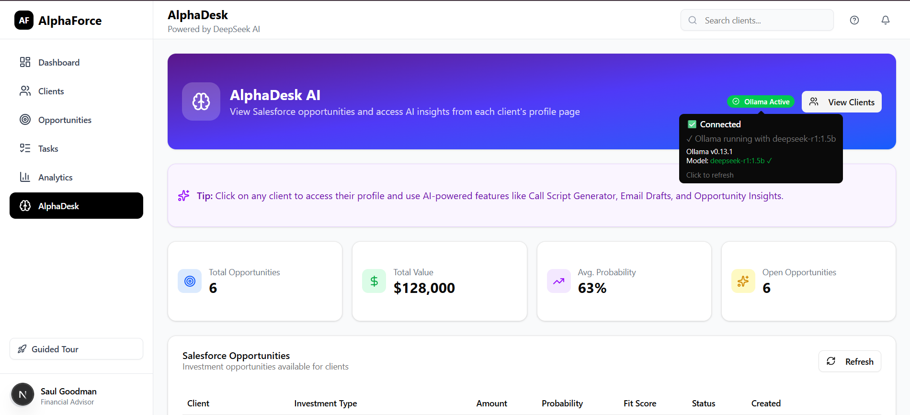
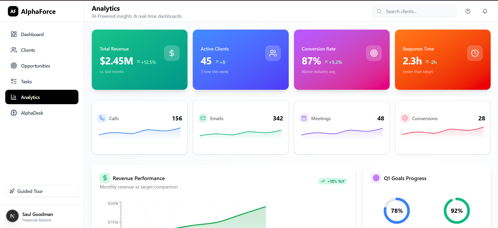
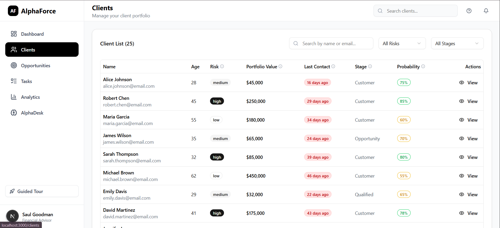
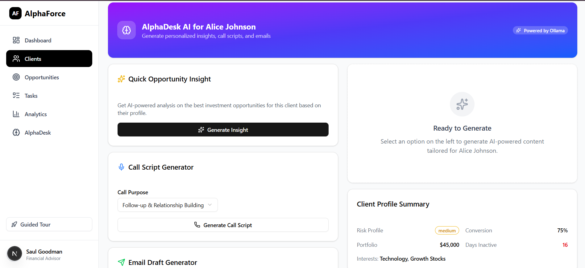

# AlphaForce - Sales Intelligence & Advisor Copilot

<div align="center">
  
  
  **AI-Powered Sales Intelligence Platform for Financial Advisors**
  
  [](https://nextjs.org/)
  [](https://www.typescriptlang.org/)
  [](https://tailwindcss.com/)
</div>

---

## 📋 Overview

AlphaForce is a comprehensive sales intelligence and advisor copilot platform designed for financial advisors. It helps prioritize client outreach, track interactions, analyze performance metrics, and generate professional PDF reports.

### Key Features

- **🎯 Smart Task Prioritization** - ML-powered scoring to identify high-priority clients
- **📊 Interactive Dashboard** - Real-time metrics and performance analytics
- **👥 Client Management** - Full client profiles with activity history
- **📈 Analytics Suite** - Advisor performance, investment insights, and contact effectiveness
- **📝 Activity Logging** - Track all client interactions (calls, emails, meetings)
- **📄 PDF Export** - Generate professional client reports
- **🔍 Global Search** - Find clients and navigate quickly

---

## 🛠️ Tech Stack

| Category             | Technology                  |
| -------------------- | --------------------------- |
| **Framework**        | Next.js 15.3.0 (App Router) |
| **Language**         | TypeScript 5.0              |
| **Styling**          | Tailwind CSS v4             |
| **UI Components**    | shadcn/ui                   |
| **State Management** | Zustand                     |
| **Charts**           | Recharts                    |
| **PDF Generation**   | jsPDF + jsPDF-AutoTable     |
| **Notifications**    | Sonner (Toast)              |
| **Icons**            | Lucide React                |

---

## 🚀 Getting Started

### Prerequisites

- Node.js 18.0 or higher
- npm or yarn

### Installation

1. **Clone the repository**

   ```bash
   git clone <repository-url>
   cd alphaforce
   ```

2. **Install dependencies**

   ```bash
   npm install
   ```

3. **Run the development server**

   ```bash
   npm run dev
   ```

4. **Open in browser**
   ```
   http://localhost:3000
   ```

---

## 📁 Project Structure

```
alphaforce/
├── src/
│   ├── app/                    # Next.js App Router pages
│   │   ├── api/                # API routes
│   │   │   ├── activities/     # Activity logging endpoints
│   │   │   ├── clients/        # Client CRUD operations
│   │   │   ├── scoring/        # ML scoring endpoint
│   │   │   └── tasks/          # Task generation
│   │   ├── analytics/          # Analytics dashboard
│   │   ├── clients/            # Client list & detail pages
│   │   ├── tasks/              # Task management
│   │   └── page.tsx            # Main dashboard
│   ├── components/
│   │   ├── ui/                 # shadcn/ui components
│   │   ├── ActivityLogger.tsx  # Activity logging modal
│   │   ├── GlobalSearch.tsx    # Command palette search
│   │   ├── PDFExportButton.tsx # PDF report generator
│   │   └── Sidebar.tsx         # Navigation sidebar
│   ├── lib/
│   │   ├── mock-data.ts        # Sample client data
│   │   └── utils.ts            # Utility functions
│   └── store/
│       └── useStore.ts         # Zustand state management
├── public/                     # Static assets
└── package.json
```

---

## 📱 Pages & Features

### Dashboard (`/`)

- Portfolio overview with total AUM
- Active clients count
- Average probability score
- Recent activity timeline
- Quick access to priority tasks

### Clients (`/clients`)

- Searchable client table
- Filter by risk tolerance
- Sort by name, portfolio value, last contact
- Quick action buttons for logging activities

### Client Detail (`/clients/[id]`)

- Full client profile
- Investment portfolio breakdown
- Activity history with timeline
- ML-powered scoring metrics
- PDF report export

### Tasks (`/tasks`)

- Priority-sorted contact list
- Filter by priority level (High/Medium/Low)
- Quick log activity buttons
- Conversion probability indicators
- Recommended actions

### Analytics (`/analytics`)

Three comprehensive tabs:

1. **Advisor Performance** - Conversion rates, portfolio growth, client distribution
2. **Investment Insights** - Asset allocation, risk profiles, portfolio size distribution
3. **Contact Effectiveness** - Contact method performance, response rates, outcome analysis

---

## 🔌 API Endpoints

| Endpoint            | Method | Description                |
| ------------------- | ------ | -------------------------- |
| `/api/clients`      | GET    | List all clients           |
| `/api/clients/[id]` | GET    | Get client details         |
| `/api/clients/[id]` | PUT    | Update client              |
| `/api/activities`   | POST   | Log new activity           |
| `/api/scoring`      | GET    | Get ML scoring for clients |
| `/api/tasks`        | GET    | Get prioritized task list  |

---

## 🎨 UI Components

Built with **shadcn/ui** components:

- Button, Badge, Card
- Table, Tabs
- Dialog, Select, Input
- Tooltip, Avatar
- Command (for global search)
- Sonner (toast notifications)

---

## 📊 ML Scoring Algorithm

The task prioritization uses a weighted scoring system:

```
Priority Score = (daysSinceContact × 0.3) +
                 (portfolioValue × 0.25) +
                 (riskTolerance × 0.15) +
                 (recentActivity × 0.3)
```

Clients are classified as:

- **High Priority**: Score > 70
- **Medium Priority**: Score 40-70
- **Low Priority**: Score < 40

---

## 🧪 Development

### Available Scripts

```bash
# Development server
npm run dev

# Production build
npm run build

# Start production server
npm start

# Lint code
npm run lint
```

### Adding New Components

```bash
npx shadcn@latest add [component-name]
```

---

## 📝 License

This project is for demonstration purposes.

---

## 👤 Author

Built with ❤️ using Next.js, TypeScript, and Tailwind CSS.

---

## 🖼️ Screenshots

Below are screenshots from the app (images are in the `screenshots/` folder):


- **Main Landing Page**  
  

- **Landing Page (v2)**  
  

- **Product Tour**  
  
  
- **Dashboard**  
  

- **AlphaDesk**  
  

- **Analytics**  
  

- **Clients**  
  

- **Insights**  
  

